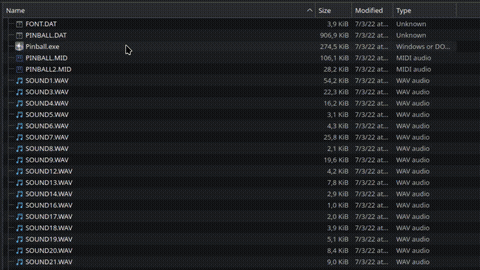

# Portable Proton App Runner

Run Windows applications and games directly from your Linux file manager using **Steam's Proton** and **Steam Runtime**, without adding them to your Steam library.

<p align="center"></p>

Features:

- Automatic per-application Proton prefixes.
- Optional custom prefixes.
- MangoHud support.
- Desktop integration through a `.desktop` file.

### Installation:

```
curl -fsSL https://raw.githubusercontent.com/Scratchaker/Portable-Proton-App-Runner/main/scripts/install.sh | bash
```

---

# Table of Contents

- [Dependencies](#dependencies)
- [Installation and Uninstallation](#installation-and-uninstallation)
- [Usage](docs/usage-configuration.md#usage)
- [Configuration](docs/usage-configuration.md/#configuration)
- [Troubleshooting](docs/troubleshooting.md)

---

# Dependencies
- Steam
- A Proton version (GE-Proton(recommended) or official Proton)
- Steam Linux Runtime (Sniper)
- MangoHud (optional)

---

# Installation and Uninstallation

Use the One-liner setup scripts:

Installation:

```
curl -fsSL https://raw.githubusercontent.com/Scratchaker/Portable-Proton-App-Runner/main/scripts/install.sh | bash
```

Uninstallation:

```
curl -fsSL https://raw.githubusercontent.com/Scratchaker/Portable-Proton-App-Runner/main/scripts/uninstall.sh | bash
```
